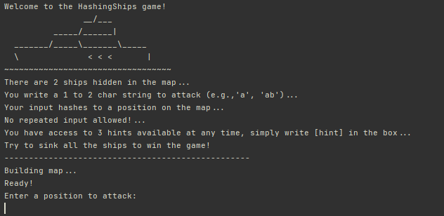

# HashingShips

_To make development easier we created a public repository where we all contributed to: [repository](https://github.com/pabloehc/cop3530-HashingShips)
That is where you will find a history of our Pull Requests._

Hashing Ships is a terminal game where users must sink ships in a hashmap.

**Running the Main method in the Main class allows you to play the game.**

## How we are using data structures in our project
- Implemented a **Hashmap** for tracking the ship's positions and number of lives.
- Implemented a **Queue** to track the hints that we give to the user.
- Used a **Set** to track user input and avoid input repetition.

## Team members:
- Pablo Hurtado
- Sofia Gonzalez 
- Carlos Mendez Monsanto

## Group contributions (we all worked on this)
- Project design, organization, github PR reviews.
- Main.
- GameFlow

## Individual Contributions
### Pablo Hurtado
- BasicHashMap interface and implementation.
- ShipHashMap and BattleMap.

### Carlos Mendez
- InputHash interface and implementation
- Hinter interface and implementation.

### Sofia Gonzalez
- Random Ships interface and implementation.
- InputValidator interface and implementation.

